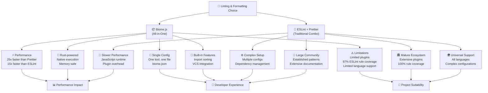

# ADR 004: Linting and Formatting Toolchain

**Date**: 2024-12-28

**Status**: Accepted

## Context

The Best Shot App requires a robust linting and formatting solution to maintain code quality, enforce consistent styling, and improve developer experience across the team. With the project being built on Expo/React Native with TypeScript, we need tooling that provides excellent performance, simplicity, and strong support for our technology stack.

The traditional approach has been to use ESLint for linting combined with Prettier for code formatting. However, modern alternatives like Biome.js have emerged, promising significant performance improvements and simplified configuration through a unified toolchain.

## Decision Architecture Overview



## Detailed Comparison Analysis

| **Criteria**                | **Biome.js**                         | **ESLint + Prettier**                             | **Winner**             |
| --------------------------- | ------------------------------------ | ------------------------------------------------- | ---------------------- |
| **🚀 Performance**          | **25x faster** (Rust-compiled)       | Baseline (JavaScript runtime)                     | **🏆 Biome**           |
| **📦 Dependencies**         | **1 dependency**                     | 10+ dependencies (ESLint + plugins + Prettier)    | **🏆 Biome**           |
| **⚙️ Configuration**        | **Single `biome.json`**              | Multiple files (`.eslintrc`, `.prettierrc`, etc.) | **🏆 Biome**           |
| **🔌 Plugin Ecosystem**     | Limited (no plugins yet)             | **Massive ecosystem** (1000+ plugins)             | **🏆 ESLint+Prettier** |
| **🌍 Language Support**     | JS/TS/JSON/CSS/JSX                   | **Universal** (any language via plugins)          | **🏆 ESLint+Prettier** |
| **📚 React Native Support** | **Excellent** (built-in JSX support) | Good (requires plugins)                           | **🏆 Biome**           |
| **🛠️ Expo Compatibility**   | **Perfect** (modern toolchain)       | Good (established patterns)                       | **🏆 Biome**           |
| **👥 Community Maturity**   | Young (2+ years)                     | **Mature** (10+ years)                            | **🏆 ESLint+Prettier** |
| **🔧 Maintenance**          | **Single tool updates**              | Multiple tool coordination                        | **🏆 Biome**           |
| **📖 Learning Curve**       | **Minimal** (good defaults)          | Steep (complex configurations)                    | **🏆 Biome**           |

## Decision

**We will adopt Biome.js as our primary linting and formatting solution** for the Best Shot App.

### Technical Rationale

1. **⚡ Performance Excellence**: Biome.js delivers 25x faster formatting and 15x faster linting compared to traditional tools, significantly improving CI/CD pipeline performance and developer feedback loops.

2. **🎯 Perfect Technology Alignment**:

   - Built-in support for TypeScript, JSX, and JSON
   - Excellent Expo/React Native compatibility
   - Native support for our cross-platform target (Web, iOS, Android)

3. **🧹 Simplified Toolchain**:

   - Single dependency vs 10+ for ESLint+Prettier setup
   - One configuration file (`biome.json`) vs multiple config files
   - Unified command interface (`biome check --apply`)

4. **🔋 Built-in Features**:

   - Import sorting and organization
   - VCS integration for smarter file processing
   - Comprehensive error messages with code context
   - Concrete Syntax Tree (CST) for better formatting precision

5. **🚀 Future-Proof Architecture**:
   - Rust-based native execution
   - Memory-safe and highly optimized
   - Active development with clear roadmap (Biome 2.0)
   - Strong financial backing and community support

### Project-Specific Benefits

For the Best Shot App specifically:

- **🎮 Game Development Focus**: Faster tooling means more time for feature development
- **👥 Team Velocity**: Simplified setup reduces onboarding complexity
- **📱 Cross-Platform Efficiency**: Single tool handles all our target platforms
- **🏗️ Clean Architecture**: Aligns with our preference for minimal root-level configuration
- **⚡ CI/CD Optimization**: Faster linting improves deployment pipeline performance

## Implementation Strategy

### Migration Plan

```bash
# 1. Install Biome
npm install --save-dev @biomejs/biome

# 2. Initialize configuration
npx biome init

# 3. Auto-migrate existing configs (if any)
npx biome migrate eslint --write
npx biome migrate prettier --write

# 4. Validate setup
npx biome check --apply

# 5. Update package.json scripts
npm pkg set scripts.lint="biome check ."
npm pkg set scripts.lint:fix="biome check --apply ."
npm pkg set scripts.format="biome format --write ."
```

### Package.json Integration

```json
{
  "scripts": {
    "lint": "biome check .",
    "lint:fix": "biome check --apply .",
    "format": "biome format --write .",
    "lint:staged": "biome check --error-on-warnings --no-errors-on-unmatched --staged ."
  }
}
```

### VSCode Integration

```json
// .vscode/settings.json
{
  "editor.defaultFormatter": "biomejs.biome",
  "editor.codeActionsOnSave": {
    "source.organizeImports.biome": "explicit",
    "source.fixAll.biome": "explicit",
    "quickfix.biome": "explicit"
  },
  "[typescript]": {
    "editor.defaultFormatter": "biomejs.biome"
  },
  "[typescriptreact]": {
    "editor.defaultFormatter": "biomejs.biome"
  }
}
```

## Consequences

### Benefits

- **⚡ Performance Gains**: 15-25x faster execution improves development workflow
- **🧹 Reduced Complexity**: Single tool eliminates configuration overhead
- **🔧 Better Developer Experience**: Unified interface and excellent error messages
- **📈 Improved Productivity**: Less time configuring tools, more time building features
- **🚀 Future-Ready**: Modern Rust-based architecture scales with project growth
- **💰 Cost Efficiency**: Faster CI/CD cycles reduce infrastructure costs

### Potential Drawbacks

- **🔌 Limited Plugin Ecosystem**: No plugin system currently (planned for Biome 2.0)
- **📉 Rule Coverage Gap**: 97% ESLint compatibility (missing 3% may require workarounds)
- **🧪 Relative Newness**: Less battle-tested than ESLint+Prettier in enterprise environments
- **🏗️ Monorepo Limitations**: Current monorepo support is limited (actively being improved)

### Risk Mitigation

- **Plugin Gap**: Biome 2.0 roadmap includes plugin system
- **Rule Coverage**: Monitor Biome releases for additional rule implementations
- **Stability**: Active monitoring of project health and community feedback
- **Fallback Plan**: Can migrate back to ESLint+Prettier if critical issues arise

## Alternatives Considered

### ESLint + Prettier (Traditional)

**Pros**:

- Mature ecosystem with 1000+ plugins
- Universal language support
- Extensive community knowledge base
- Battle-tested in enterprise environments

**Cons**:

- Significantly slower performance (baseline)
- Complex configuration requiring multiple tools
- Higher maintenance overhead
- More dependencies to manage

**Why Rejected**: Performance and complexity concerns outweigh ecosystem maturity for our project scale and requirements.

### OXC Linter

**Pros**:

- Rust-based performance (1.02x faster than Biome)
- Focused linting solution

**Cons**:

- Linter-only (no formatting)
- Limited language support
- Less mature than Biome
- Smaller community

**Why Rejected**: Lack of formatting capability would require additional tools, defeating the simplicity goal.

### Continue with Current Setup

**Pros**:

- No migration effort required
- Known configuration and behavior

**Cons**:

- Misses performance improvements
- Complex toolchain maintenance
- Slower developer feedback loops

**Why Rejected**: Opportunity cost of improved developer experience and performance gains.

## Success Metrics

- **⏱️ Performance**: Measure linting/formatting execution time reduction
- **🔧 Developer Satisfaction**: Team feedback on tooling experience
- **⚡ CI/CD Speed**: Build pipeline performance improvements
- **📊 Code Quality**: Maintain or improve code quality metrics
- **🐛 Issue Reduction**: Monitor linting-related issues and false positives

## Implementation Timeline

- **Phase 1** (Week 1): Install and configure Biome.js
- **Phase 2** (Week 1): Update development scripts and CI/CD integration
- **Phase 3** (Week 2): Team training and editor setup
- **Phase 4** (Week 2): Monitor and fine-tune configuration
- **Phase 5** (Week 3): Performance measurement and optimization

## Conclusion

Biome.js represents the next generation of JavaScript tooling, offering significant performance improvements and developer experience enhancements. For the Best Shot App, this decision aligns perfectly with our modern technology stack, performance requirements, and team productivity goals.

The unified toolchain approach reduces complexity while delivering superior performance, making it an ideal choice for our Expo/React Native project targeting multiple platforms. The active development roadmap and strong community support provide confidence in the long-term viability of this decision.

This choice positions the Best Shot App with modern, efficient tooling that will scale with our development needs and contribute to faster iteration cycles and improved code quality.
