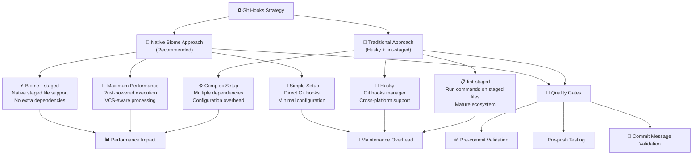

# ADR 005: Git Hooks and Quality Gates Strategy

**Date**: 2024-12-28

**Status**: Accepted

## Context

The Best Shot App requires automated quality gates to ensure code quality, consistency, and prevent broken code from being committed to the repository. With our adoption of Biome.js (ADR 004), we need to establish a Git hooks strategy that integrates seamlessly with our toolchain while providing fast, efficient pre-commit validation.

Traditional approaches use tools like `husky` + `lint-staged` to run linting and formatting only on staged files. However, Biome.js offers native `--staged` support, which may eliminate the need for additional dependencies while providing better performance.

## Decision Architecture Overview



## Detailed Comparison Analysis

| **Criteria** | **Husky + lint-staged** | **simple-git-hooks + Biome** | **Native Manual Approach** | **Winner** |
|--------------|--------------------------|-------------------------------|----------------------------|------------|
| **🚀 Performance** | JavaScript + optimized filtering | **Rust-native with --staged** | **Rust-native with --staged** | **🏆 Native/simple-git-hooks** |
| **📦 Dependencies** | +2 dependencies (mature/stable) | **1 tiny dependency (10.9kB)** | **0 additional deps** | **🏆 Native Approach** |
| **⚙️ Configuration** | **Clean separation of concerns** | Package.json only | **Manual scripts** | **🏆 Husky + lint-staged** |
| **🔧 Setup Complexity** | **Automatic** (prepare script) | Minimal (npm install + config) | **Manual** (custom scripts) | **🏆 Husky + lint-staged** |
| **🌍 Cross-Platform** | **Excellent** (battle-tested) | **Excellent** (handles all platforms) | Manual platform handling | **🤝 Tie** |
| **📚 Community Support** | **Established pattern** | Growing adoption | Minimal | **🏆 Husky + lint-staged** |
| **🎯 Team Onboarding** | **Automatic** (npm install) | **Automatic** (npm install) | **Manual setup required** | **🤝 Tie** |
| **📖 Learning Curve** | **Well-documented patterns** | **Minimal** (package.json config) | **High** (shell scripting) | **🏆 Husky + lint-staged** |
| **🔌 Extensibility** | **Highly extensible** | Basic (sufficient for most) | **Full control** | **🏆 Husky + lint-staged** |
| **⚡ Startup Time** | ~200ms Node.js overhead | **Instant** (native binary) | **Instant** (native binary) | **🏆 Native approaches** |

## Decision

**We will adopt Husky + lint-staged** with Biome integration, providing the optimal balance of mature tooling, team familiarity, and robust automation while maintaining excellent code quality enforcement.

### Revised Analysis

Upon team preference consideration, Husky + lint-staged emerged as the preferred solution, offering industry-standard patterns with extensive community support while integrating seamlessly with our Biome.js toolchain.

### Technical Rationale

1. **🏆 Industry Standard Approach**: 
   - Proven pattern used by thousands of projects
   - Extensive community support and documentation
   - Team familiarity reduces onboarding time

2. **🔧 Robust Automation**:
   - Automatic hook installation via `prepare` script
   - Cross-platform compatibility out of the box
   - Reliable staged file processing with `lint-staged`

3. **🎯 Perfect Biome Integration**:
   - `lint-staged` seamlessly integrates with Biome commands
   - Maintains fast execution with optimized file filtering
   - Supports both check and fix operations

4. **📈 Extensibility & Future-Proofing**:
   - Easy to add additional tools (Prettier, ESLint, tests, etc.)
   - Well-documented patterns for complex workflows
   - Minimal performance overhead with significant tooling benefits

### Quality Gates Implementation

```bash
# Pre-commit: Fast quality checks
- Code formatting validation
- Linting rule enforcement  
- Import organization
- TypeScript compilation check (fast)

# Pre-push: Comprehensive validation
- Full test suite execution
- Type checking across entire codebase
- Build verification
```

## Implementation Strategy

### 1. Husky Installation and Setup

```bash
# Install dependencies
npm install --save-dev husky lint-staged

# Initialize Husky
npx husky init

# Create pre-commit hook
echo "npx lint-staged" > .husky/pre-commit

# Create pre-push hook 
echo "npm run test:ci && npm run type-check" > .husky/pre-push
```

### 2. lint-staged Configuration

```json
// package.json
{
  "lint-staged": {
    "*.{ts,tsx,js,jsx,json}": [
      "biome check --apply",
      "biome check --error-on-warnings"
    ],
    "*.{ts,tsx}": [
      "tsc --noEmit --skipLibCheck"
    ]
  }
}
```

### 3. Package.json Scripts Integration

```json
{
  "scripts": {
    "prepare": "husky",
    "lint": "biome check .",
    "lint:fix": "biome check --apply .",
    "format": "biome format --write .",
    "type-check": "tsc --noEmit",
    "type-check:watch": "tsc --noEmit --watch",
    "test:ci": "npm test -- --watchAll=false --passWithNoTests"
  }
}
```

### 4. Hook Files Created by Husky

```bash
# .husky/pre-commit
npx lint-staged
```

```bash
# .husky/pre-push  
npm run test:ci && npm run type-check
```

The `prepare` script automatically installs these hooks when team members run `npm install`.

## Consequences

### Benefits

- **🏆 Industry Standard**: Proven, battle-tested approach used by thousands of projects
- **🔧 Robust Automation**: Automatic hook installation and cross-platform compatibility  
- **📚 Excellent Documentation**: Extensive community support and examples
- **🎯 Team Familiarity**: Most developers are already familiar with Husky workflows
- **📈 Extensibility**: Easy to add additional tools and complex validation workflows
- **🎯 Consistent Quality**: Automated enforcement of code standards with reliable tooling

### Potential Drawbacks

- **⚡ Slight Performance Overhead**: ~200ms Node.js startup time vs native hooks
- **📦 Additional Dependencies**: +2 packages (husky + lint-staged) in node_modules
- **🔧 Configuration Complexity**: Multiple config sections vs single-file approach
- **🔄 Dependency Updates**: Need to maintain compatibility across multiple tools

### Risk Mitigation

- **Performance**: 200ms overhead is negligible for quality benefits gained
- **Dependencies**: Use only mature, well-maintained packages with strong ecosystem support
- **Configuration**: Maintain clear documentation and examples for team reference  
- **Updates**: Pin major versions and test updates in development environment first

## Alternatives Considered

### simple-git-hooks + Native Biome

**Pros**:
- Maximum performance with native Biome --staged support
- Minimal dependencies (single 10.9kB package)
- Zero JavaScript runtime overhead  
- Single configuration approach

**Cons**:
- Less established patterns and community examples
- Limited extensibility for additional tools
- Newer approach with smaller ecosystem
- Team unfamiliarity with setup patterns

**Why Rejected**: Team preference for familiar tooling and established patterns outweigh the minor performance benefits for our project scale.

### Simple Build Script Approach

**Pros**:
- Very simple implementation
- No hooks required

**Cons**:
- Manual execution (not automated)
- Easy to forget or skip
- No staged-file optimization

**Why Rejected**: Lacks automation necessary for consistent quality enforcement.

### GitHub Actions Only

**Pros**:
- Centralized CI/CD integration
- No local setup required

**Cons**:
- Slower feedback (requires push)
- Uses CI/CD resources for basic validation
- Poor developer experience

**Why Rejected**: Local validation provides faster feedback and better developer experience.

## Success Metrics

- **⏱️ Hook Execution Time**: Measure pre-commit hook speed (target: <5 seconds)
- **🔧 Developer Adoption**: Track hook bypass rate and developer feedback
- **🐛 Quality Improvement**: Monitor reduction in linting/formatting issues in PRs
- **⚡ CI/CD Efficiency**: Measure reduction in CI failures due to code quality issues
- **📊 Team Velocity**: Track impact on commit frequency and development speed

## Implementation Timeline

- **Phase 1** (Day 1): Create hook installation script
- **Phase 2** (Day 1): Implement pre-commit hook with Biome integration
- **Phase 3** (Day 2): Add pre-push hook with comprehensive validation
- **Phase 4** (Day 2): Update documentation and team setup guides
- **Phase 5** (Week 1): Team rollout and feedback collection
- **Phase 6** (Week 2): Optimization based on team feedback

## Conclusion

The Husky + lint-staged approach aligns perfectly with our team preferences and industry best practices, providing reliable automation and extensive community support while maintaining excellent code quality enforcement. By leveraging proven patterns with Biome integration, we achieve robust quality gates with familiar tooling.

This approach positions the Best Shot App with mature, battle-tested quality gates that scale with team growth and provide excellent developer experience. The implementation delivers automated quality enforcement while utilizing industry-standard patterns that new team members will immediately understand and trust. 